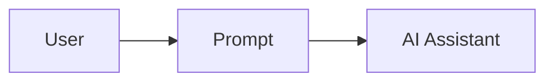
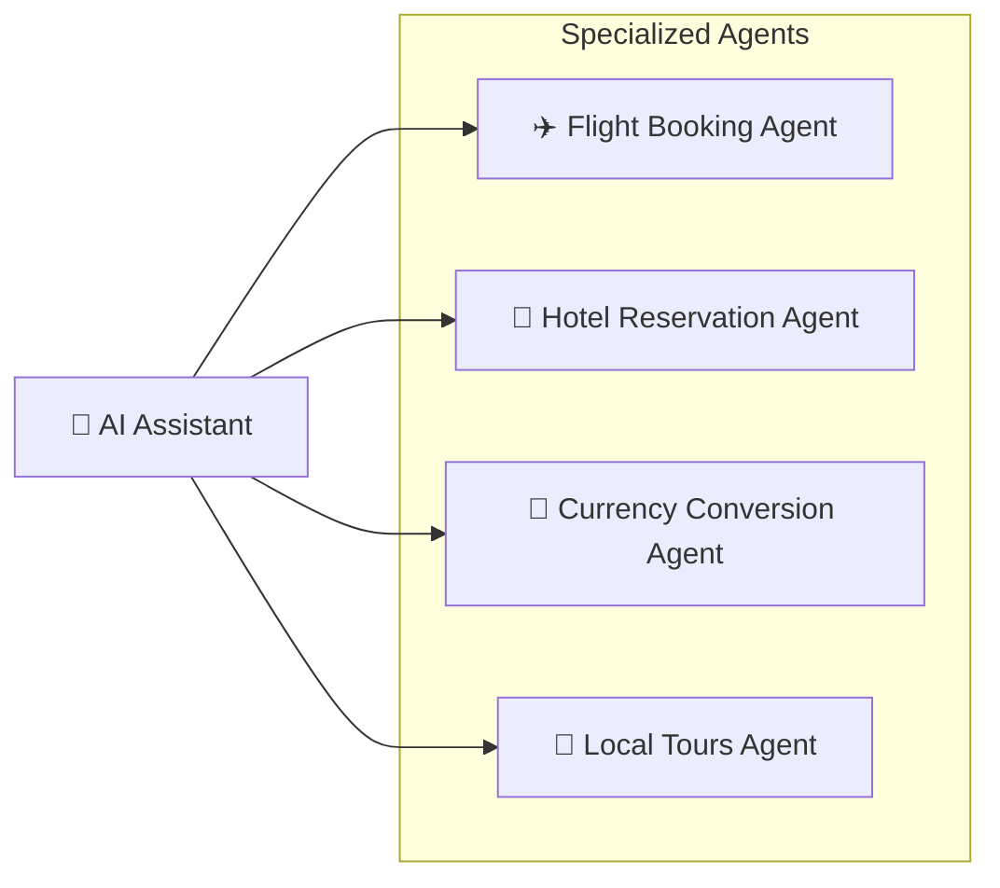
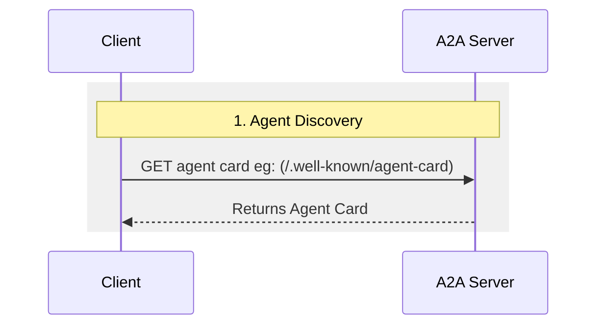
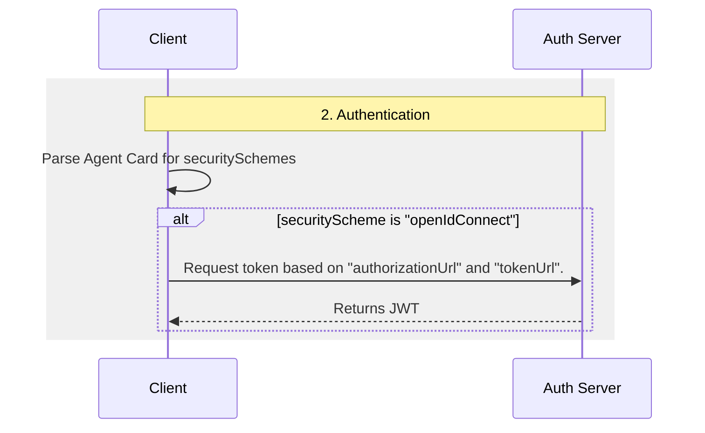
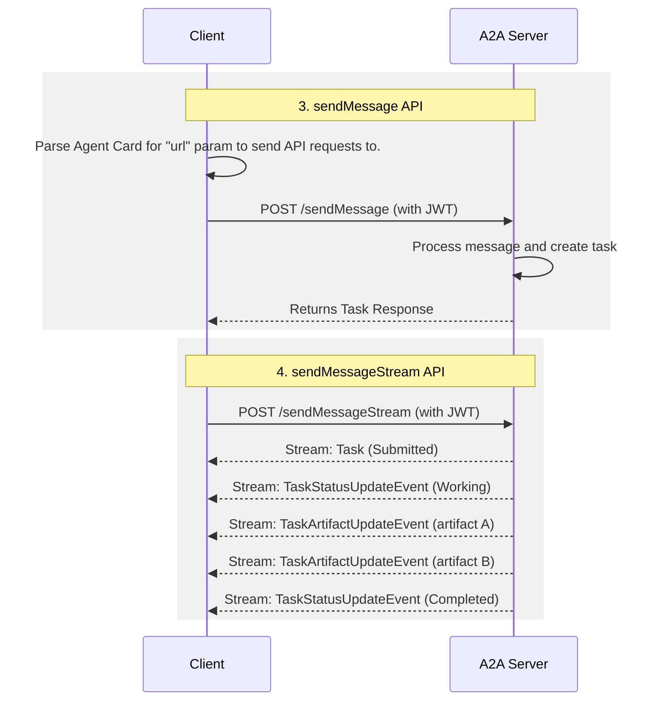

# What is A2A?

The A2A protocol is an open standard for communication between AI agents. It
gives agents a common language, whatever framework or vendor built them. This
makes them interoperable and breaks down silos. Agents are autonomous
problem-solvers that act on their own within their environment. With A2A, agents
from different developers, frameworks, and organizations can work together.

## Why Use the A2A Protocol

A2A addresses key challenges in AI agent collaboration. It provides
a standardized approach for agents to interact. This section explains the
problems A2A solves and the benefits it offers.

### Problems that A2A Solves

Consider a user request for an AI assistant to plan an international trip. This
task involves orchestrating multiple specialized agents, such as:

- A flight booking agent
- A hotel reservation agent
- An agent for local tour recommendations
- A currency conversion agent

Without A2A, integrating these diverse agents presents several challenges:

- **Agent Exposure**: To expose agents to each other, developers often wrap
    them as tools, much like the Model Context Protocol (MCP) exposes tools. But
    this is inefficient: agents are built to negotiate directly, and wrapping
    them as tools limits what they can do. A2A exposes agents as they are, with
    no wrapping.
- **Custom Integrations**: Each interaction requires custom, point-to-point
    solutions, creating significant engineering overhead.
- **Slow Innovation**: Bespoke development for each new integration slows
    innovation.
- **Scalability Issues**: Systems become difficult to scale and maintain as
    the number of agents and interactions grows.
- **Interoperability**: This approach limits interoperability,
    preventing the organic formation of complex AI ecosystems.
- **Security Gaps**: Ad hoc communication often lacks consistent security
    measures.

A2A solves these challenges. It lets AI agents interoperate, so they can
interact reliably and securely.

### A2A Example Scenario

This example shows how the A2A (Agent2Agent) protocol helps AI agents handle complex interactions.

#### A User's Complex Request

A user interacts with an AI assistant, giving it a complex prompt like "Plan an international trip."

#### The Need for Collaboration

The AI assistant receives the prompt and realizes it needs to call upon multiple specialized agents to fulfill the request. These agents include a Flight Booking Agent, a Hotel Reservation Agent, a Currency Conversion Agent, and a Local Tours Agent.

#### The Interoperability Challenge

The core problem: The agents are unable to work together because each has its own bespoke development and deployment.

The consequence of a lack of a standardized protocol is that these agents cannot collaborate with each other let alone discover what they can do. The individual agents (Flight, Hotel, Currency, and Tours) are isolated.

#### The "With A2A" Solution

The A2A Protocol gives agents standard methods and data structures to talk to one another. This holds whatever their underlying implementation. The same agents now form an interconnected system, communicating through the shared protocol.

The AI assistant now acts as an orchestrator. It gathers the results from every A2A-enabled agent and presents a single, complete travel plan in response to the user's prompt.

{ width="70%" style="margin:20px auto;display:block;" }

### Core Benefits of A2A

Implementing the A2A protocol offers significant advantages across the AI ecosystem:

- **Secure collaboration**: Without a standard, secure communication between
    agents is hard to guarantee. A2A uses HTTPS and keeps operations opaque, so
    agents can't see the inner workings of the agents they collaborate with.
- **Interoperability**: A2A breaks down silos between AI agent ecosystems. Agents
    from different vendors and frameworks work together.
- **Agent autonomy**: With A2A, agents keep their own capabilities and stay
    autonomous while they collaborate.
- **No custom integrations**: You don't build bespoke plugins or point-to-point
    code to connect agents. The same protocol reaches them wherever they run: on
    your machine, in the cloud, or hosted by a vendor. It connects agents across
    teams, projects, and companies. Teams focus on the value their agents provide.
- **Support for LRO**: The protocol supports long-running operations (LRO). It
    handles streaming with Server-Sent Events (SSE) and asynchronous execution.

### Key Design Principles of A2A

A2A development follows principles that prioritize broad adoption,
enterprise-grade capabilities, and future-proofing.

- **Simplicity**: A2A leverages existing standards like HTTP, JSON-RPC, and
    Server-Sent Events (SSE). This avoids reinventing core technologies and
    accelerates developer adoption.
- **Enterprise Readiness**: A2A meets critical enterprise needs. It follows
    standard web practices for authentication, authorization, security, privacy,
    tracing, and monitoring.
- **Asynchronous**: A2A natively supports long-running tasks. It handles
    scenarios where agents or users might not remain continuously connected. It
    uses mechanisms like streaming and push notifications.
- **Modality Independent**: Agents can communicate using many content types.
    This supports rich, flexible interactions beyond plain text.
- **Opaque Execution**: Agents collaborate without exposing their internal
    logic, memory, or proprietary tools. Interactions rely on declared
    capabilities and shared context. This protects intellectual property and
    improves security.

### Understanding the Agent Stack: A2A, MCP, Agent Frameworks and Models

A2A is situated within a broader agent stack, which includes:

- **A2A:** Standardizes communication among agents, across organizations and frameworks.
- **MCP:** Connects models to data and external resources.
- **Agent frameworks (e.g., LangGraph, CrewAI, ADK):** Provide toolkits for constructing agents.
- **Models:** Fundamental to an agent's reasoning, these can be any Large Language Model (LLM).

{ width="70%" style="margin:20px auto;display:block;" }

#### A2A and MCP

You may already know protocols that support interactions between agents, models, and tools. The Model Context Protocol (MCP) is one emerging standard. It focuses on connecting Large Language Models (LLMs) with data and external resources.

The Agent2Agent (A2A) protocol is a shared language for AI agents, especially agents in other systems. A2A complements MCP: it covers a distinct but related part of agent interaction.

- **MCP's Focus:** Reducing the complexity involved in connecting agents with tools and data. Tools are typically stateless and perform specific, predefined functions (e.g., a calculator, a database query).
- **A2A's Focus:** Letting agents collaborate in their native modalities. They communicate as agents (or as users), not through tool-like interactions. This supports complex, multi-turn interactions where agents reason, plan, and delegate tasks. For example, they can negotiate or ask for clarification when placing an order.

{ width="70%" style="margin:20px auto;display:block;" }

Wrapping an agent as a simple tool is limiting: it can't capture the agent's full capabilities. The post [Why Agents Are Not Tools](https://discuss.google.dev/t/agents-are-not-tools/192812) explores this distinction.

For a more in-depth comparison, refer to the [A2A and MCP Comparison](a2a-and-mcp.md) document.

#### A2A and Agent Frameworks

A2A is a communication protocol for agents. It enables inter-agent communication
regardless of the framework used to build each agent. Teams build agents with a
range of agent development kits and frameworks — such as LangGraph, CrewAI, ADK,
and others — and A2A lets agents built with any of them work together. The
protocol does not depend on, or favor, any single framework.

### A2A Request Lifecycle

A request follows four main steps across three stages: agent discovery, authentication, and the messaging APIs (`sendMessage` and `sendMessageStream`). The diagrams below break the flow into these three stages and show how the client, A2A server, and auth server interact.

#### 1. Agent discovery

The client fetches the server's Agent Card to learn its capabilities and endpoint.

#### 2. Authentication

The client reads the Agent Card's security schemes and obtains a token when one is required.

#### 3. The sendMessage and sendMessageStream APIs

The client sends messages to the server's endpoint — either a single request/response with `sendMessage`, or a stream of task updates with `sendMessageStream`.

## What's Next

Pick the path that fits you:

- **Prefer a hands-on approach?** Build your first agent with the [Python tutorial](../tutorials/python/1-introduction.md).
- **Want the foundations?** Read the [Key Concepts](./key-concepts.md) that underpin the A2A protocol.
- **Want to deep dive in the A2A Protocol?** The [A2A specification](../specification.md) is the source of truth for every capability, method, and data structure.
